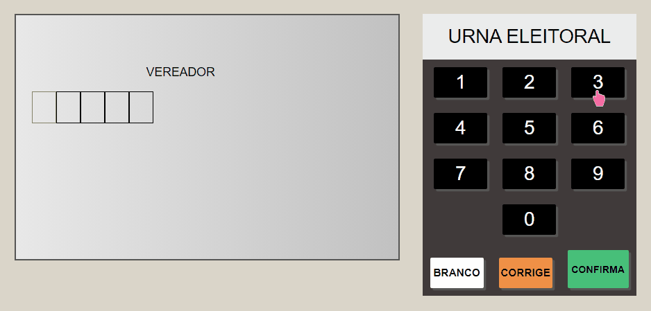
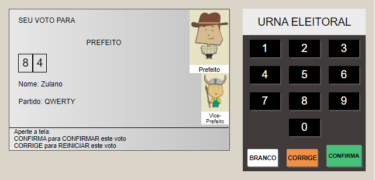

:computer: Atualizado em 31 de Maio de 2021 :computer:

# Projeto Digital - Criando a urna eletrônica

## Descrição

Este projeto tem como objetivo construir uma página no qual será abordado os conhecimentos estudados sobre a linguagem JavaScript, além de HTML e CSS.

## Link

https://gabrielcoelhox.github.io/urna-eletronica/

## :camera: Veja:

## Tecnologias Utilizadas

- JavaScript;
- HTML5;
- CSS3.
